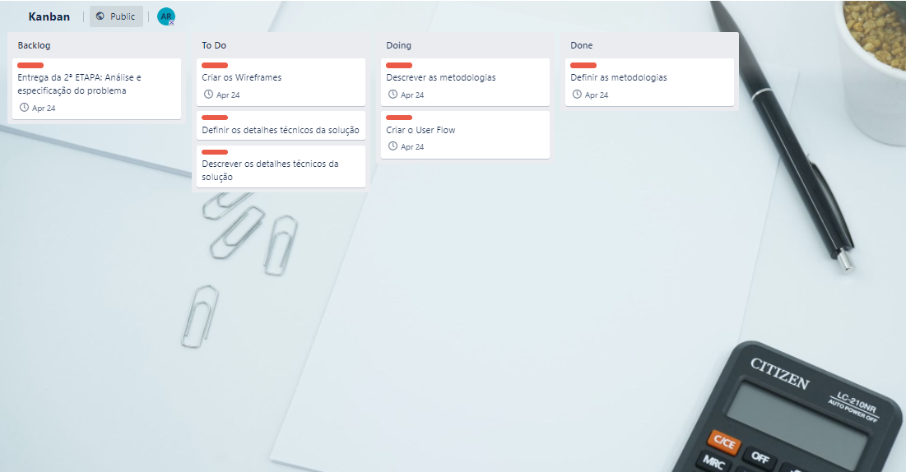

# Metodologia

A metodologia descreve as ferramentas utilizadas pela equipe no desenvolvimento do código, na organização do time e na execução das demais etapas do projeto.

## Relação de Ambientes de Trabalho

As etapas do projeto são desenvolvidos a partir de diversas plataformas e a relação destas com seu respectivo propósito é apresentada na lista que se segue:
- O GitHub é o repositório do código fonte e o local de armazenamento da documentação;
- O MarvelApps é a plataforma de design responsável pela criação do Wireframe e do User Flow;
- O Trello é o gerenciador de projetos utilizado para a aplicação do Scrum.

## Gestão de código fonte

O projeto segue a seguinte convenção para o nome de branches:

- `main`: versão estável já testada do software
- `unstable`: versão já testada do software, porém instável
- `testing`: versão em testes do software
- `dev`: versão de desenvolvimento do software

Quanto à gerência de issues, o projeto adota a seguinte convenção para
etiquetas:

- `documentation`: melhorias ou acréscimos à documentação
- `bug`: uma funcionalidade encontra-se com problemas
- `enhancement`: uma funcionalidade precisa ser melhorada
- `feature`: uma nova funcionalidade precisa ser introduzida

Discuta como a configuração do projeto foi feita na ferramenta de versionamento escolhida. Exponha como a gerência de tags, merges, commits e branchs é realizada. Discuta como a gerência de issues foi realizada.

> **Links Úteis**:
> - [Tutorial GitHub](https://guides.github.com/activities/hello-world/)
> - [Git e Github](https://www.youtube.com/playlist?list=PLHz_AreHm4dm7ZULPAmadvNhH6vk9oNZA)
>  - [Comparando fluxos de trabalho](https://www.atlassian.com/br/git/tutorials/comparing-workflows)
> - [Understanding the GitHub flow](https://guides.github.com/introduction/flow/)
> - [The gitflow workflow - in less than 5 mins](https://www.youtube.com/watch?v=1SXpE08hvGs)

## Gerenciamento de Projeto

O Scrum foi o framework ágil escolhido para o desenvolvimento do projeto.

A equipe está organizada da seguinte forma:
- Product Owner: Adrian Kevem
-	Scrum Master: Vivian Toyota
-	Equipe de Desenvolvimento: Igor Goveia, Lorena Ribeiro e Ronaldo Gama.

Para organização e distribuição das tarefas do projeto, a equipe está utilizando o Trello e o kanban estruturado com as seguintes listas: 

-	Backlog: Recebe todas as atividades identificadas no decorrer do projeto
-	To Do: Este é o Sprint atual que estamos trabalhando.
-	Doing: Quando uma tarefa é iniciada, ela é movida para cá.
-	Done: Recebe todas as tarefas do Sprint atual já finalizadas.

O quadro kanban do grupo no Trello está disponível através da URL https://trello.com/b/JMfAcqmm/kanban e é apresentado na figura abaixo. 

